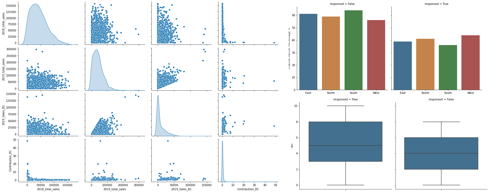

# Marketing analysis  for communication method development 

## Summary

* Created a model that ranks communication methods according to its influence of channel partner to response to the campaign (email and calls are the best) with 81% accuracy.
* Engineered features from the sales of the coffee to know the coffee sales comparing to total sales and other brands.
* Optimized logistic , KNN, Decision Tree, Naive Bayes, extreme gradient boosting,SVM and Random Forest classifier using GridsearchCV to reach the best model.
* Got insights and proposed actions to be taken.

## Code ENV

**Python Version:** 3.9  
**Packages:** Pandas, Numpy, sklearn, matplotlib, seaborn, xgboost, imblearn, category_encoders, statsmodels, datetime

## Problem Statement

* A leading FMCG company which manufactures and sells 7 products (Coffee,Biscuits, Juice, Chocolates, Ice cream, Bottled water, Baby food).
* The company launched a new flavor variant of coffee brand in January 2020. The marketing campaign was executed for their Channel Partners and end consumers before the product launch For Channel Partners, the company introduced the product and reward system through SMS, email and call.
* For end consumers, product samples were given and initial opinion was understood through primary market research.
* **Project objectives**:

 1. identify the best communication method will lead Channel partners to response to the campaign
 2. identify which Channel partners responded and who to target first in the next planned campaign

## Data Cleaning

After reading the data files, I needed to clean it up so that it was usable for our model and get insights . I made the following changes and created the following variables:

* Merged the four data files.
* Created these columns: Total sales in 2018, Total sales in 2019, Coffee sales in 2019, Coffee contribution to Total sales , Buying frequency, Coffee Buying frequency, Channel partner activation in last quarter.
* filled None values with zero.
* Onehot encoded the region column.
* replaced outliers thats are out 3 times SD with mean.
* scaled numerical columns.
  
## EDA

I looked at channel partner responses against most of the independent variables and the distribution of numerical variables.

## Model Building

First, I split the data into train and tests sets with 80% to 20 respectively %. Also, I removed insignificant variables using variance inflation factor.

I tried six different models and evaluated them using : accuracy, precision, recall, f1-score, AUC,ROC curve, Lift curve and KS statistic test where accuracy is the primary evaluation metric used for final model selection because there is no imbalance in the modeled data.
I started with logistic regression as baseline then rest of six models with the following results:

I picked Random forest model as the best one considering over fitting beside the accuracy with these scores:
accuracy = 0.81, precision of responded= 0.88, recall = 0.70, f1-score = 0.78, AUC = 0.86,   KS statistic maximum difference = 0.614 .
with feature importance as below :

## Insights and actions to take

1. Use email and call respectively in future campaign where they have great influence in customer responsiveness to campaign and avoid using SMS.
2. avoid  email or call the channel partner more than 2 times which will not have impact in customers responses.
3. Regions have consistent performance.
4. Work with Channel partner with less Net Promote scorer to increase their responsiveness.
